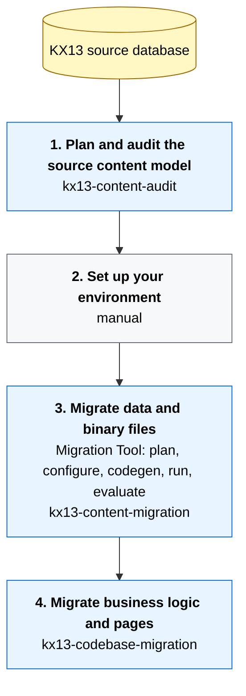

# KX13 upgrade plugins

This repository provides three plugins that are intended to be used together to assist in a Kentico Xperience 13 (KX13) upgrade to Xperience by Kentico (XbyK). The plugins serve as companions to the [Upgrade to Xperience by Kentico](https://docs.kentico.com/x/upgrade_to_xbyk_guides) guides, enabling you to use AI agents to help with parts of the migration process. This document explains the recommended end-to-end path and where each plugin fits.

If you are new to the upgrade process, start with the [Upgrade from Kentico Xperience 13](https://docs.kentico.com/x/migrate_from_kx13_guides) section for the conceptual overview and capability comparison, then follow the [step-by-step walkthrough](https://docs.kentico.com/x/upgrade_walkthrough_guides). Finally, the [Speed up remodeling with AI](https://docs.kentico.com/x/speed_up_remodeling_with_ai_guides) deep dive describes the broader rationale for AI-assisted upgrades.

## Plugins at a glance

| Plugin | Role |
|---|---|
| [KX13 content audit](../plugins/kx13-content-audit/README.md) | An AI skill plus a bundled .NET CLI that snapshots a KX13 database into structured JSON and a Markdown report. Provides initial information for the migration plan. |
| [Content migration support KX13 → XbyK](../plugins/kx13-content-migration/README.md) | Provides eight skills that help agents work with the [Kentico Migration Tool](https://github.com/Kentico/xperience-by-kentico-kentico-migration-tool) end-to-end — produce the migration plan, generate the tool's `appsettings.json`, generate the [C# extensions for `Migration.Tool.Extensions`](https://github.com/Kentico/xperience-by-kentico-kentico-migration-tool/blob/master/Migration.Tool.Extensions/README.md) (`IClassMapping`, `IFieldMigration`, `IWidgetMigration`, `ContentItemDirectorBase`), execute the CLI, and evaluate the result. |
| [KX13 codebase migration](../plugins/kx13-codebase-migration/README.md) | Provides five skills that migrate the live-site codebase — global code, pages, widgets, shared components, and visual parity. |

## Recommended upgrade path

The end-to-end upgrade process has five stages. The first maps to the planning phase as described on [Plan your upgrade approach](https://docs.kentico.com/x/migrate_from_kx13_overview_guides#plan-your-upgrade-approach). After, stages 2-5 map onto the four steps of the [walkthrough series](https://docs.kentico.com/x/upgrade_walkthrough_guides).

Each plugin is useful in a different stage:

> [!NOTE]
> The content-migration stage needs to complete before the codebase stage starts. The codebase plugin generates C# entity classes from the migrated XbyK database with `--kxp-codegen`, and the content types need to exist in the target before that command runs.

### 1. Plan and audit the source content model

Maps to the [Plan your upgrade approach](https://docs.kentico.com/x/migrate_from_kx13_overview_guides#plan-your-upgrade-approach) stage of the upgrade overview.

The **kx13-content-audit** plugin snapshots the source database into structured JSON plus a Markdown report. The output covers content tree, page types, custom tables, custom modules, forms, page-builder components, page relationships, and content references.

That snapshot is the input to the `migrate-plan` skill in stage 3, which interprets it to decide content-type strategy and migration-toolkit configuration.

The auditor does **not** capture KX13 categories, commerce data, or marketing entities (contacts excluded — see plugin-specific scope below). Review those manually using [Plan your strategy for migrating features](https://docs.kentico.com/x/plan_your_strategy_for_migrating_features_guides) and the [commerce features overview](https://docs.kentico.com/x/xperience_upgrade_commerce_features_overview_guides) guides.

### 2. Set up your environment

Maps to the [Set up your environment](https://docs.kentico.com/x/setup_your_environment_guides) walkthrough step and the environment-setup section of [Prep for the upgrade and transfer data](https://docs.kentico.com/x/prep_for_migration_and_transfer_data_guides).

To set up the migration environment:

1. Hotfix KX13 to **Refresh 5 (13.0.64)** or newer — the migration tool depends on fields added in this refresh.
2. Pick an XbyK version compatible with a KMT release per the [Library Version Matrix](https://github.com/Kentico/xperience-by-kentico-kentico-migration-tool/blob/master/README.md#library-version-matrix), and install it using the [`kentico-xperience-mvc` project template](https://docs.kentico.com/x/DQKQC).
3. Clone the [Kentico Migration Tool](https://github.com/Kentico/xperience-by-kentico-kentico-migration-tool); the `Migration.Tool.Extensions` project is where stage 3's codegen skills write `IClassMapping`, `IFieldMigration`, `IWidgetMigration`, and `ContentItemDirectorBase` implementations. See the [Extensions README](https://github.com/Kentico/xperience-by-kentico-kentico-migration-tool/blob/master/Migration.Tool.Extensions/README.md) for the project layout.
4. Source instance: rejoin a separated contact-management database if applicable; the source must be running during migration.
5. Target instance: must **not** be running during migration; must be empty (or carry only data from prior migration runs — for re-runs, delete contacts, activities, consent agreements, form submissions, and custom-module-class data first per the [target-instance setup](https://github.com/Kentico/xperience-by-kentico-kentico-migration-tool/blob/master/Migration.Tool.CLI/README.md#set-up-the-target-instance)).

### 3. Migrate data and binary files

Maps to the [Migrate data and binary files](https://docs.kentico.com/x/migrate_data_and_binary_files_guides) walkthrough step and the data-migration section of [Prep for the upgrade and transfer data](https://docs.kentico.com/x/prep_for_migration_and_transfer_data_guides).

The **Content migration support KX13 → XbyK** plugin covers this whole stage. Its eight skills group into four phases:

#### Plan

- `migrate-plan` — turns the audit output into a Migration Overview + Migration Detail document. The Migration Detail is the primary input every later skill consumes. The [Speed up remodeling with AI](https://docs.kentico.com/x/speed_up_remodeling_with_ai_guides) deep dive describes the AI patterns this skill operationalizes for content type and field-mapping decisions. Concretely, the plan derives:

  - Which page types to convert to reusable content types → [`ConvertClassesToContentHub`](https://github.com/Kentico/xperience-by-kentico-kentico-migration-tool/blob/master/Migration.Tool.CLI/README.md#convert-pages-or-custom-tables-to-content-hub).
  - Which fields to extract into [reusable field schemas](https://docs.kentico.com/x/D4_OD) → `ReusableSchemaBuilder` / `CreateReusableFieldSchemaForClasses`.
  - How to handle linked pages and ad-hoc relationships → [`ContentItemDirectorBase`](https://github.com/Kentico/xperience-by-kentico-kentico-migration-tool/blob/master/Migration.Tool.Extensions/README.md#content-item-directors-contentitemdirectorbase).
  - Which page-builder widgets need transforms vs. carry over as-is.

#### Configure

- `migrate-appsettings` — generates the Migration Tool's `appsettings.json` (connection strings, `ConvertClassesToContentHub`, `CreateReusableFieldSchemaForClasses`, `EntityConfigurations`, `OptInFeatures`, `AssetRootFolders`, `MigrationProtocolPath`). The skill is content-only by default; it includes `CommerceConfiguration` (`CommerceSiteNames`, `IncludeCustomerSystemFields`, `OrderStatuses`, `KX13OrderFilter`) only when the user explicitly requests commerce migration.

#### Generate code extensions (any order, skip irrelevant)

These four skills are independent — run only the ones the plan calls for, in any order. Each writes C# directly into `Migration.Tool.Extensions`. The deep dives map to skills as follows:

| Deep dive | Skill |
|---|---|
| [Remodel page types as reusable field schemas](https://docs.kentico.com/x/remodel_page_types_as_reusable_field_schemas_guides) | `migrate-classes` (`ReusableSchemaBuilder`) |
| [Transfer parent-child page hierarchy to the Content hub](https://docs.kentico.com/x/transfer_page_hierarchy_to_content_hub_guides) | `migrate-content-items` (`ContentItemDirectorBase` + `LinkChildren`) |
| [Upgrade widgets from KX13](https://docs.kentico.com/x/migrate_widgets_from_KX13_guides) (concept) | informs `migrate-widgets` decisions (legacy / API discovery / adjust) |
| [Migrate widget data as reusable content](https://docs.kentico.com/x/migrate_widget_data_as_reusable_content_guides) | `migrate-widgets` (`IWidgetMigration`) |
| [Transform widget properties](https://docs.kentico.com/x/transform_widget_properties_guides) | `migrate-widgets` (`IWidgetPropertyMigration`) |
| [Convert child pages to widget content](https://docs.kentico.com/x/convert_child_pages_to_widgets_guides) | `migrate-content-items` (`AsWidget` directive on the director) |
| [Migrate widget-collection relationships](https://docs.kentico.com/x/migrate_widget_collection_relationships_guides) (concept) | informs `migrate-plan`; implementation via `migrate-content-items` / `migrate-widgets` |
| [Optimize images during your upgrade](https://docs.kentico.com/x/optimize_images_during_upgrade_guides) | **not currently automated** — requires editing `Migration.Tool.Source/AssetFacade.cs` directly. Plan for it as a manual customization. |

`migrate-fields` covers cross-class field transforms (`IFieldMigration`) when a transform applies globally rather than within a single class mapping.

#### Execute and evaluate (iterate)

- `migrate-run` — executes a single combined `migrate` CLI invocation with all required flags (the tool orders them internally), monitors output, applies fixes.
- `migrate-eval` — compares the migrated XbyK database against the plan, emits an HTML report, and routes findings back to the appropriate sibling skill (`migrate-appsettings`, codegen skills, or manual fix-up) for each remediation step.

Treat run + eval as a loop. Almost every non-trivial migration takes multiple iterations — the deep dives above structure themselves the same way (e.g., [Migrate widget data as reusable content](https://docs.kentico.com/x/migrate_widget_data_as_reusable_content_guides) explicitly runs the migration twice: once excluding the affected pages, once with the custom widget logic). The [Plan for an iterative process](https://docs.kentico.com/x/prep_for_migration_and_transfer_data_guides#plan-for-an-iterative-process) section lists the object types that need manual deletion between re-runs.

### 4. Adjust global code & 5. Display an upgraded page

Maps to the [Adjust global code on the backend](https://docs.kentico.com/x/adjust_global_code_guides) and [Display an upgraded page](https://docs.kentico.com/x/display_an_upgraded_page_guides) walkthrough steps, with [Adjust your code and adapt your project](https://docs.kentico.com/x/migrate_your_code_guides) as the conceptual companion.

The **KX13 codebase migration** plugin covers the work described across both walkthrough steps, which it treats as a single iterative loop per page (the walkthrough's clean 4 vs. 5 split holds for Dancing Goat, but real projects' work spans both). Stage 3 must complete first: the codebase plugin runs `dotnet run -- --kxp-codegen` to generate strongly-typed C# classes from the migrated XbyK database, so the content types must already exist in the target.

- `migrate-global-code` — sets up the XbyK project foundation (a `{ProjectName}.Entities` class library with the `CMS.AssemblyDiscoverableAttribute` assembly attribute), generates entity classes via [`--kxp-codegen`](https://docs.kentico.com/x/5IbWCQ), copies global code (localization, shared views, styles and scripts, identifiers, service registrations), and configures `Program.cs` for Page Builder + content-tree-based routing.
- `migrate-page-widgets` — migrates Page Builder widgets and sections used by a page; this is the codebase counterpart to `migrate-widgets` from stage 3, converting KX13 `[EditingComponent(...)]` attributes to the new XbyK [form-component attributes](https://docs.kentico.com/x/8ASiCQ) (`[TextInputComponent]`, `[ContentItemSelectorComponent]`, etc.) per [Transform widget properties](https://docs.kentico.com/x/transform_widget_properties_guides).
- `migrate-page` — migrates a page's controller, views, repositories, and dependencies. Converts KX13 `IPageRetriever` / `DocumentHelper` / `TreeProvider` / `DocumentQuery` patterns to XbyK's [`IContentRetriever`](https://docs.kentico.com/x/content_retriever_api_xp) / [`ContentItemQueryBuilder`](https://docs.kentico.com/x/WhT_Cw) per [Upgrade your content retrieval code](https://docs.kentico.com/x/upgrade_content_retrieval_code_guides).
- `migrate-shared-component` — migrates reusable components (header, footer, navigation) using the same content-retrieval API conversion.
- `migrate-page-visual` — uses Playwright to align the migrated page visually with the KX13 original.

## What the plugins don't cover

- **Commerce storefront**: checkout/cart/shipping/payment code, product catalog modeling, and storefront UI. The underlying Migration Tool now migrates customers and orders (added in January 2026 per [Plan your strategy for migrating features](https://docs.kentico.com/x/plan_your_strategy_for_migrating_features_guides#digital-commerce)) — `migrate-appsettings` can emit the relevant settings (`CommerceSiteNames`, `IncludeCustomerSystemFields`, `OrderStatuses`, `KX13OrderFilter`) when the user explicitly opts into commerce migration; otherwise the skill omits `CommerceConfiguration` per its content-only default.
- **Marketing**: marketing automation, contact groups, personas, A/B testing, social marketing, email marketing — see the [feature matrix](https://docs.kentico.com/x/plan_your_strategy_for_migrating_features_guides#activities-and-digital-marketing) for which entities are out of scope.
- **Search**: not migrated; pick one of [Lucene](https://github.com/Kentico/xperience-by-kentico-lucene), [Azure AI Search](https://github.com/Kentico/xperience-by-kentico-azure-ai-search), or [Algolia](https://github.com/Kentico/xperience-by-kentico-algolia) and integrate manually per [Adjust your code and adapt your project](https://docs.kentico.com/x/migrate_your_code_guides#choose-a-search-integration).
- **Custom-module UI pages**, KX13 alternative-form deltas, and ACLs. `migrate-classes` can route custom-table data into reusable content types via `ConvertClassesToContentHub` to skip the UI work entirely; otherwise the UI pages must be built manually per [Adjust your code and adapt your project](https://docs.kentico.com/x/migrate_your_code_guides#rehome-custom-tables).
- **External sign-in information** (Facebook/Google/etc.) and the member registration/authentication code path itself. Basic member records migrate via the `--members` parameter; the live-site auth code must be rewritten to work with the new `Member` object type and ASP.NET Identity per [Adjust your code and adapt your project](https://docs.kentico.com/x/migrate_your_code_guides#alter-auth-and-user-management).
- **Integration bus**, license keys, and `web.config`/`appsettings.json` settings — not migrated.
- **Image optimization during migration** (target format, quality, dimensions per content type) — requires editing `Migration.Tool.Source/AssetFacade.cs` directly per [Optimize images during your upgrade](https://docs.kentico.com/x/optimize_images_during_upgrade_guides); not currently automated by any skill.

For these, follow the [Upgrade from Kentico Xperience 13](https://docs.kentico.com/x/migrate_from_kx13_guides) section and the per-plugin READMEs for the exact scope of each plugin.
