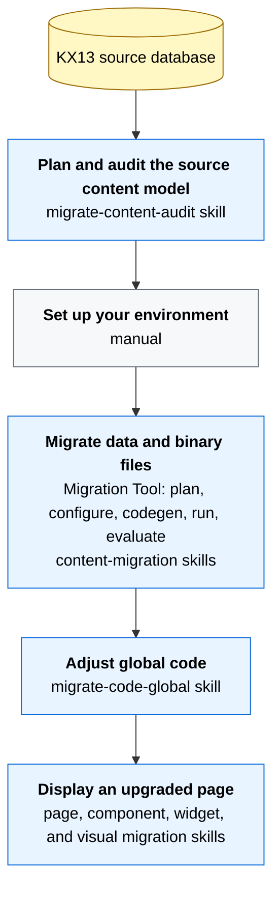

# Kentico Xperience 13 to Xperience by Kentico migration

Skills, references, and helper tooling for upgrading Kentico Xperience 13 (KX13) projects to [Xperience by Kentico](https://docs.kentico.com/x/migrate_from_kx13_guides) (XbyK). The plugin bundles three skill groups: content-model audit, content migration, and codebase migration. Use them together as companions to the [Upgrade to Xperience by Kentico](https://docs.kentico.com/x/upgrade_to_xbyk_guides) guides.

## Start here

1. Read the [upgrade workflow](#upgrade-workflow) for the sequence and boundaries.
2. Prepare the source, target, and Migration Tool versions using Kentico's [official upgrade walkthrough](https://docs.kentico.com/x/upgrade_walkthrough_guides).
3. Install this plugin and configure the [MCP servers required for the stages you will use](./MCP-setup.md).
4. Start with `migrate-content-audit`, then follow the workflow through content and code migration.

## Requirements

- KX13 Refresh 5 (hotfix 13.0.64) or newer with access to the source database
- An XbyK target compatible with the selected [Kentico Migration Tool release](https://github.com/Kentico/xperience-by-kentico-kentico-migration-tool/blob/master/README.md#library-version-matrix)
- A local clone of the [Kentico Migration Tool](https://github.com/Kentico/xperience-by-kentico-kentico-migration-tool)
- .NET 8 SDK or newer
- `sqlcmd` for validation queries used by the migration skills
- An AI coding assistant with this plugin installed
- The MCP servers required for the selected migration stages, as listed in [MCP setup](./MCP-setup.md)

Follow the Migration Tool's [source-instance](https://github.com/Kentico/xperience-by-kentico-kentico-migration-tool/blob/master/Migration.Tool.CLI/README.md#set-up-the-source-instance) and [target-instance](https://github.com/Kentico/xperience-by-kentico-kentico-migration-tool/blob/master/Migration.Tool.CLI/README.md#set-up-the-target-instance) requirements before running a migration.

## Installation

Follow the marketplace instructions in the [usage guide](../../docs/Usage-Guide.md#install-the-selected-plugin), using the plugin name `kentico-kx13-migration`.

## Upgrade workflow

The workflow starts with planning and auditing, then follows the [walkthrough series](https://docs.kentico.com/x/upgrade_walkthrough_guides) through environment setup, data migration, global code adjustment, and page display stages.

If you are new to the upgrade process, start with the [Upgrade from Kentico Xperience 13](https://docs.kentico.com/x/migrate_from_kx13_guides) section for the conceptual overview and capability comparison, then follow the [step-by-step walkthrough](https://docs.kentico.com/x/upgrade_walkthrough_guides). Finally, the [Speed up remodeling with AI](https://docs.kentico.com/x/speed_up_remodeling_with_ai_guides) deep dive describes the broader rationale for AI-assisted upgrades.

Each skill group is useful in a different stage of the upgrade process:



> [!NOTE]
> The content-migration stage needs to complete before the codebase stage starts. The codebase-migration skills generate C# entity classes from the migrated XbyK database with `--kxp-codegen`, and the content types need to exist in the target before that command runs.

### Plan and audit the source content model

Maps to the [Plan your upgrade approach](https://docs.kentico.com/x/migrate_from_kx13_overview_guides#plan-your-upgrade-approach) stage of the upgrade overview.

The `migrate-content-audit` skill snapshots the source database into structured JSON plus a Markdown report. The output covers content tree, page types, custom tables, custom modules, forms, Page Builder components, page relationships, and content references. That snapshot is the input to the `migrate-content-plan` skill, which interprets it to decide content-type strategy and migration-toolkit configuration.

The auditor does **not** capture KX13 categories, commerce data, or marketing entities. Contacts are also excluded from the audit. See [Scope and limitations](#scope-and-limitations). Review those manually using [Plan your strategy for migrating features](https://docs.kentico.com/x/plan_your_strategy_for_migrating_features_guides) and the [commerce features overview](https://docs.kentico.com/x/xperience_upgrade_commerce_features_overview_guides) guides.

See [Content-model audit](#content-model-audit) for setup and invocation.

### Set up your environment

Maps to the [Set up your environment](https://docs.kentico.com/x/setup_your_environment_guides) walkthrough step and the environment-setup section of [Prep for the upgrade and transfer data](https://docs.kentico.com/x/prep_for_migration_and_transfer_data_guides).

To set up the migration environment:

1. Hotfix KX13 to **Refresh 5 (13.0.64)** or newer. The Migration Tool depends on fields added in this refresh.
2. Pick an XbyK version compatible with a Kentico Migration Tool release per the [Library Version Matrix](https://github.com/Kentico/xperience-by-kentico-kentico-migration-tool/blob/master/README.md#library-version-matrix), and install it using the [`kentico-xperience-mvc` project template](https://docs.kentico.com/x/DQKQC).
3. Clone the [Kentico Migration Tool](https://github.com/Kentico/xperience-by-kentico-kentico-migration-tool). The `Migration.Tool.Extensions` project is where the content-migration code-generation skills write `IClassMapping`, `IFieldMigration`, `IWidgetMigration`, and `ContentItemDirectorBase` implementations. See the [Extensions README](https://github.com/Kentico/xperience-by-kentico-kentico-migration-tool/blob/master/Migration.Tool.Extensions/README.md) for the project layout.
4. Source instance: rejoin a separated contact-management database if applicable. The source must be running during migration.
5. Target instance: must **not** be running during migration, and must be empty (or carry only data from prior migration runs). For re-runs, delete contacts, activities, consent agreements, form submissions, and custom-module-class data first per the [target-instance setup](https://github.com/Kentico/xperience-by-kentico-kentico-migration-tool/blob/master/Migration.Tool.CLI/README.md#set-up-the-target-instance).

### Migrate data and binary files

Maps to the [Migrate data and binary files](https://docs.kentico.com/x/migrate_data_and_binary_files_guides) walkthrough step and the data-migration section of [Prep for the upgrade and transfer data](https://docs.kentico.com/x/prep_for_migration_and_transfer_data_guides).

The content-migration skills cover this whole stage as a plan, configure, generate, execute, and evaluate loop. See [Content migration](#content-migration) for the workspace layout, skill sequence, deep-dive mapping, and rules.

### Adjust global code and display an upgraded page

Maps to the [Adjust global code on the backend](https://docs.kentico.com/x/adjust_global_code_guides) and [Display an upgraded page](https://docs.kentico.com/x/display_an_upgraded_page_guides) walkthrough steps, with [Adjust your code and adapt your project](https://docs.kentico.com/x/migrate_your_code_guides) as the conceptual companion.

The codebase-migration skills cover both walkthrough areas as a single iterative loop per page because real projects often span global-code adjustment and page display. See [Codebase migration](#codebase-migration) for the skill sequence, examples, and rules.

---

## Content-model audit

`migrate-content-audit` runs the bundled .NET auditor against the KX13 database and exports the source model. Use its output as the input to `migrate-content-plan`.

The marketplace package exposes the skill, but the .NET source under `src/` must also be available in the workspace. See the [content auditor guide](./docs/content-auditor.md) for setup, CLI flags, output files, scope, and test coverage.

### migrate-content-audit

```text
/migrate-content-audit

Audit the DancingGoatMvc site as the starting point for migrating it to
Xperience by Kentico. Export the full content model into ./audit-results/
```

---

## Content migration

These skills drive the [Kentico Migration Tool](https://github.com/Kentico/xperience-by-kentico-kentico-migration-tool): they turn the audit into a plan, generate configuration and extensions, run the migration, and evaluate the result.

Place the source, target, Migration Tool, and audit output in one workspace:

```
<workspace-root>/
├── KX13/                            # KX13 source project
├── XbyK/                            # XbyK target project
├── audit-results/                   # Optional: migrate-content-audit JSON + report
├── kentico-migration-tool/
│   ├── Migration.Tool.CLI/          # appsettings.json is generated here
│   └── Migration.Tool.Extensions/   # Generated C# extensions are placed here
└── MigrationProtocol/               # Created by migrate-content-run; consumed by migrate-content-eval
```

> [!TIP]
> Other layouts can work, but this structure reduces discovery ambiguity.

The skills run in four phases. The configure, generate, run, and evaluate phases form an iterative loop.

### Skill sequence

| Phase | Skill | Outcome |
|---|---|---|
| Plan | `migrate-content-plan` | `migration-overview.md` and the authoritative `migration-detail.md` |
| Configure | `migrate-content-appsettings` | Migration Tool `appsettings.json` traced to the plan |
| Generate | `migrate-content-classes` | `IClassMapping` and optional `ReusableSchemaBuilder` extensions |
| Generate | `migrate-content-fields` | Cross-class `IFieldMigration` extensions |
| Generate | `migrate-content-widgets` | `IWidgetMigration` and `IWidgetPropertyMigration` extensions |
| Generate | `migrate-content-items` | `ContentItemDirectorBase` logic for linked pages, references, and page-to-widget conversions |
| Execute | `migrate-content-run` | One dependency-ordered migration run plus protocol and console logs |
| Evaluate | `migrate-content-eval` | An HTML report comparing the databases and plan, with remediation routing |

Run all four generate-phase skills. Each reads `migration-detail.md`, skips when its extension type is unnecessary, and builds the extensions project after writing code.

`migrate-content-plan` turns the audit output into a Migration Overview and a Migration Detail document. The Migration Detail is the primary input every later skill consumes. The [Speed up remodeling with AI](https://docs.kentico.com/x/speed_up_remodeling_with_ai_guides) deep dive describes the AI patterns this skill operationalizes for content-type and field-mapping decisions. Concretely, the plan derives:

- Which page types to convert to reusable content types → [`ConvertClassesToContentHub`](https://github.com/Kentico/xperience-by-kentico-kentico-migration-tool/blob/master/Migration.Tool.CLI/README.md#convert-pages-or-custom-tables-to-content-hub).
- Which fields to extract into [reusable field schemas](https://docs.kentico.com/x/D4_OD) → `ReusableSchemaBuilder` / `CreateReusableFieldSchemaForClasses`.
- How to handle linked pages and ad-hoc relationships → [`ContentItemDirectorBase`](https://github.com/Kentico/xperience-by-kentico-kentico-migration-tool/blob/master/Migration.Tool.Extensions/README.md#content-item-directors-contentitemdirectorbase).
- Which Page Builder widgets need transforms and which carry over as-is.

`migrate-content-appsettings` generates the Migration Tool's `appsettings.json` (connection strings, `ConvertClassesToContentHub`, `CreateReusableFieldSchemaForClasses`, `EntityConfigurations`, `OptInFeatures`, `AssetRootFolders`, `MigrationProtocolPath`). The skill is content-only by default. It includes `CommerceConfiguration` (`CommerceSiteNames`, `IncludeCustomerSystemFields`, `OrderStatuses`, `KX13OrderFilter`) only when you explicitly request commerce migration.

### Deep-dive guides

Kentico's deep-dive guides map to the content-migration skills as follows:

| Deep dive | Skill |
|---|---|
| [Remodel page types as reusable field schemas](https://docs.kentico.com/x/remodel_page_types_as_reusable_field_schemas_guides) | `migrate-content-classes` (`ReusableSchemaBuilder`) |
| [Transfer parent-child page hierarchy to the Content hub](https://docs.kentico.com/x/transfer_page_hierarchy_to_content_hub_guides) | `migrate-content-items` (`ContentItemDirectorBase` + `LinkChildren`) |
| [Upgrade widgets from KX13](https://docs.kentico.com/x/migrate_widgets_from_KX13_guides) | informs `migrate-content-widgets` decisions (legacy / API discovery / adjust) |
| [Migrate widget data as reusable content](https://docs.kentico.com/x/migrate_widget_data_as_reusable_content_guides) | `migrate-content-widgets` (`IWidgetMigration`) |
| [Transform widget properties](https://docs.kentico.com/x/transform_widget_properties_guides) | `migrate-content-widgets` (`IWidgetPropertyMigration`) |
| [Convert child pages to widget content](https://docs.kentico.com/x/convert_child_pages_to_widgets_guides) | `migrate-content-items` (`AsWidget` directive on the director) |
| [Migrate widget-collection relationships](https://docs.kentico.com/x/migrate_widget_collection_relationships_guides) | informs `migrate-content-plan`, with implementation via `migrate-content-items` / `migrate-content-widgets` |
| [Optimize images during your upgrade](https://docs.kentico.com/x/optimize_images_during_upgrade_guides) | **not currently automated** – requires editing `Migration.Tool.Source/AssetFacade.cs` directly. Plan for it as a manual customization. |

`migrate-content-fields` covers cross-class field transforms (`IFieldMigration`) when a transform applies globally rather than within a single class mapping.

The exact parameters and execution guardrails live in each skill's `SKILL.md`. Invoke the skill with the plan path rather than copying those instructions into the prompt.

### Example: plan and configure

```text
/migrate-content-plan

Create the migration plan from ./audit-results/.
```

```text
/migrate-content-appsettings

Generate the Migration Tool configuration from ./migration-detail.md.
```

### Example: execute and evaluate

```text
/migrate-content-run

Run the migration described by ./migration-detail.md.
```

```text
/migrate-content-eval

Evaluate the result against ./migration-detail.md and identify which
skill or manual step should address each finding.
```

### Content-migration rules

- Audit before planning and treat `migration-detail.md` as the source of truth.
- Review all generated configuration and C# extensions before running the Migration Tool.
- Build `Migration.Tool.Extensions` successfully before `migrate-content-run`.
- Run the Migration Tool once with the combined flags selected from the plan. The tool orders them by dependency.
- Keep `MigrationProtocolPath` stable between run and evaluation.
- Treat configure → generate → run → evaluate as a loop until the report is acceptable. Most issues identified by `migrate-content-eval` require a re-run of an earlier phase, and the skill output instructs you about which skills to rerun.

The deep dives above suggest similar working patterns. For example, [Migrate widget data as reusable content](https://docs.kentico.com/x/migrate_widget_data_as_reusable_content_guides) explicitly runs the migration twice: once excluding the affected pages, once with the custom widget logic. The [Plan for an iterative process](https://docs.kentico.com/x/prep_for_migration_and_transfer_data_guides#plan-for-an-iterative-process) section lists the object types that need manual deletion between re-runs.

---

## Codebase migration

These skills migrate the live-site foundation and presentation code. Content migration must complete first: the skills run `dotnet run -- --kxp-codegen` to generate strongly typed C# classes from the migrated XbyK database, so the content types must already exist in the target.

Place the source and target projects in the same workspace:

```
KX13/          # Kentico Xperience 13 project files
XbyK/          # Xperience by Kentico project files
```

Start the KX13 application or provide an accessible URL. Leave the XbyK application stopped unless a skill starts it for validation.

### Skill sequence

| Order | Skill | Outcome |
|---|---|---|
| Once | `migrate-code-global` | XbyK project foundation, generated entity classes, global assets, routing, and Page Builder setup |
| Per shared element | `migrate-code-component` | Migrated header, footer, navigation, or other shared component |
| Per Page Builder page | `migrate-code-page-widgets` | Migrated widgets and sections used by the page |
| Per page | `migrate-code-page` | Migrated controller, retrieval code, view model, views, and dependencies |
| When needed | `migrate-code-page-visual` | Visual alignment between the source and target page |

- `migrate-code-global` – sets up the XbyK project foundation (a `{ProjectName}.Entities` class library with the `CMS.AssemblyDiscoverableAttribute` assembly attribute), generates entity classes via [`--kxp-codegen`](https://docs.kentico.com/x/5IbWCQ), copies global code (localization, shared views, styles and scripts, identifiers, service registrations), and configures `Program.cs` for Page Builder and content-tree-based routing.
- `migrate-code-component` – migrates reusable components (header, footer, navigation) using the content-retrieval API conversion described for `migrate-code-page`.
- `migrate-code-page-widgets` – migrates Page Builder widgets and sections used by a page. This is the codebase counterpart to the content-migration `migrate-content-widgets` skill, converting KX13 `[EditingComponent(...)]` attributes to the new XbyK [form-component attributes](https://docs.kentico.com/x/8ASiCQ) (`[TextInputComponent]`, `[ContentItemSelectorComponent]`, etc.) per [Transform widget properties](https://docs.kentico.com/x/transform_widget_properties_guides).
- `migrate-code-page` – migrates a page's controller, views, repositories, and dependencies. Converts KX13 `IPageRetriever` / `DocumentHelper` / `TreeProvider` / `DocumentQuery` patterns to XbyK's [`IContentRetriever`](https://docs.kentico.com/x/content_retriever_api_xp) / [`ContentItemQueryBuilder`](https://docs.kentico.com/x/WhT_Cw) per [Upgrade your content retrieval code](https://docs.kentico.com/x/upgrade_content_retrieval_code_guides).
- `migrate-code-page-visual` – uses Playwright to align the migrated page visually with the KX13 original.

Skip `migrate-code-page-widgets` for pages that do not use Page Builder. Use `migrate-code-page-visual` only after the page is functional.

### Example: initialize the target

```text
/migrate-code-global
```

### Example: migrate a shared component

```text
/migrate-code-component

componentName: breadcrumbs
legacyPageUrl: https://localhost:5001/en-us/home
```

### Example: migrate a Page Builder page

```text
/migrate-code-page-widgets

pageName: home
legacyPageUrl: https://localhost:5001/en-us/home
```

```text
/migrate-code-page

pageName: home
legacyPageUrl: https://localhost:5001/en-us/home
```

```text
/migrate-code-page-visual

pageName: home
legacyPageUrl: https://localhost:5001/en-us/home
newPageUrl: http://localhost:60444/en-us/home
```

### Codebase-migration rules

- Complete content migration before generating target entity classes.
- Run page skills in order: widgets when applicable, page implementation, then visual alignment when needed.
- Keep the KX13 site accessible at the URL supplied to the skills.
- Let each skill manage the XbyK process it starts. Verify the process state before invoking the next skill.
- Review and test generated code before moving to the next page.

## Scope and limitations

The plugin assists with the content and live-site portions of the [upgrade workflow](#upgrade-workflow). The following areas are not automated:

- **Commerce storefront**: checkout/cart/shipping/payment code, product catalog modeling, and storefront UI. The underlying Migration Tool now migrates customers and orders (added in January 2026 per [Plan your strategy for migrating features](https://docs.kentico.com/x/plan_your_strategy_for_migrating_features_guides#digital-commerce)). `migrate-content-appsettings` can emit the relevant settings when you explicitly opt into commerce migration. Otherwise, the skill omits `CommerceConfiguration` per its content-only default.
- **Marketing**: marketing automation, contact groups, personas, A/B testing, social marketing, and email marketing. See the [feature matrix](https://docs.kentico.com/x/plan_your_strategy_for_migrating_features_guides#activities-and-digital-marketing) for which entities are out of scope.
- **Search**: not migrated. Pick one of [Lucene](https://github.com/Kentico/xperience-by-kentico-lucene), [Azure AI Search](https://github.com/Kentico/xperience-by-kentico-azure-ai-search), or [Algolia](https://github.com/Kentico/xperience-by-kentico-algolia) and integrate manually per [Adjust your code and adapt your project](https://docs.kentico.com/x/migrate_your_code_guides#choose-a-search-integration).
- **Custom-module UI pages**, KX13 alternative-form deltas, and ACLs. `migrate-content-classes` can route custom-table data into reusable content types via `ConvertClassesToContentHub` to skip the UI work entirely. Otherwise, the UI pages must be built manually per [Adjust your code and adapt your project](https://docs.kentico.com/x/migrate_your_code_guides#rehome-custom-tables).
- **External sign-in information** (Facebook/Google/etc.) and the member registration/authentication code path itself. Basic member records migrate via the `--members` parameter. The live-site auth code must be rewritten to work with the new `Member` object type and ASP.NET Identity per [Adjust your code and adapt your project](https://docs.kentico.com/x/migrate_your_code_guides#alter-auth-and-user-management).
- **Integration bus**, license keys, and `web.config`/`appsettings.json` settings – not migrated.
- **Image optimization during migration** (target format, quality, dimensions per content type) – requires editing `Migration.Tool.Source/AssetFacade.cs` directly per [Optimize images during your upgrade](https://docs.kentico.com/x/optimize_images_during_upgrade_guides). Not currently automated by any skill.

Use Kentico's [feature migration strategy](https://docs.kentico.com/x/plan_your_strategy_for_migrating_features_guides) and [code adaptation guide](https://docs.kentico.com/x/migrate_your_code_guides) to plan those areas.

---

## Skill customization

These skill files serve as a baseline for migrating KX13 projects to Xperience by Kentico. Modify and enhance the files as required by your implementation, workflow, and requirements. The reference materials under `skills/_shared/references/` and each skill's `references/` directory are the most useful starting points for adapting the prompts to project-specific conventions or constraints.

## License

Distributed under the MIT License. See [`LICENSE.md`](../../LICENSE.md) for more information.
